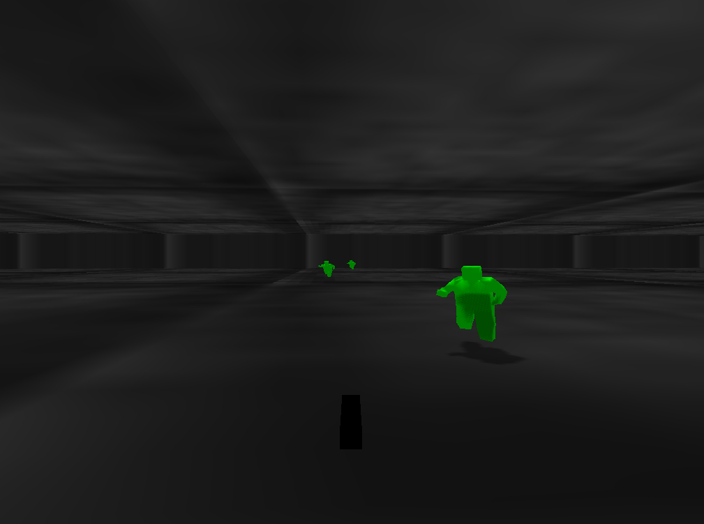

Gloom
=====

You are in a gloomy place and some anthropoids are trying to kill you.
Kill them first.

Move with the arrows. Shoot with the spacebar. Escape to quit the game.

This is a reconfiguration of the same [small3d sample game](https://github.com/dimi309/small3d-samples/tree/master/gloom), this time using [conan](https://conan.io) for dependency management and building, which greatly decreses the build command complexity and the amount of configuration needed in the CMakeLists.txt files.

Building
--------

Set up [small3d](https://github.com/dimi309/small3d-conan) with [conan](https://conan.io) on your system.

At present, the small3d package is not available on any public conan repository. It needs to be set up locally as small3d/master, using the [small3d conan recipe](https://github.com/dimi309/small3d-conan).

Before however, as a prerequisite, the [portaudio package for conan](https://github.com/bincrafters/community/tree/main/recipes/portaudio/19.7.0) also needs to be set up locally as portaudio/19.7.0.

After doing the above, just clone this repository and run:

	conan install . -s cppstd=14
	conan build .
	
... and run the game from the `bin` directory.
	
At present, Vulkan support is required for the game to run. I will enable OpenGL support on the small3d package soon (it is already supported by the small3d library).
