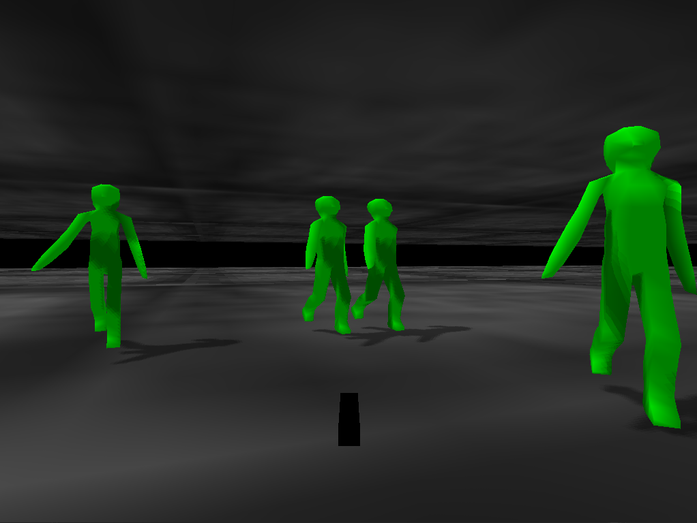

Gloom
=====

*Requires small3d* - https://github.com/dimi309/small3d

You are in a gloomy place and some anthropoids are trying to kill you.
Kill them first.

Move with the arrows. Shoot with the spacebar. Escape to quit the game.

Building
--------
Create a directory called *deps* inside the game project's root directory.
Build small3d and copy the resulting *include*, *lib* and *shaders* directories from the small3d *build* directory to the *deps* directory created. Then from the game project's root directory, do the following:
	
	mkdir build
    cd build
    cmake ..
    cmake --build .
	
On Windows, you need to execute `cmake .. -G"MinGW Makefiles"`, or with the preferred Visual Studio configuration (e.g. `cmake .. -G"Visual Studio 16 2019" -A x64`). Also if using Visual Studio, make sure to run build under the configuration that small3d was built with, e.g. `cmake --build . --config Debug`.

In order to run the game, execute:
	
	cd bin
	./gloom (or gloom.exe if you are on Windows)

For building the game with an OpenGL build of small3d, just append `-DSMALL3D_OPENGL=ON` to the `cmake ..` command.
